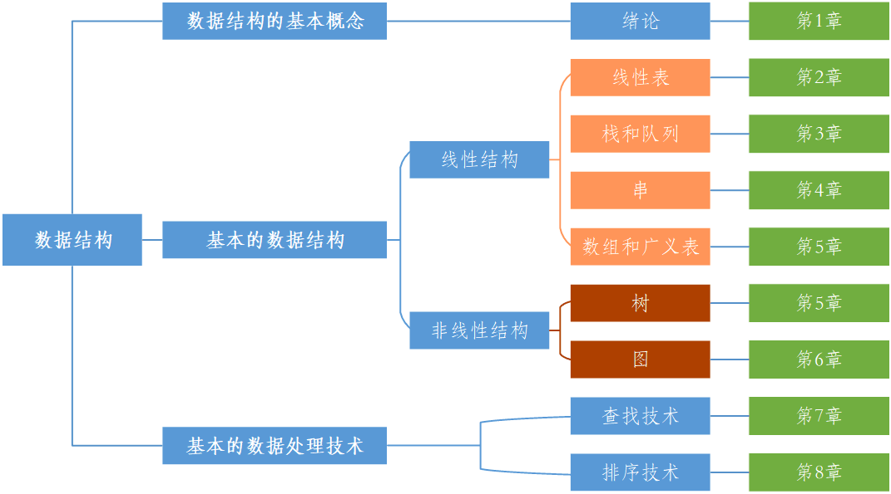

本笔记配套学习教材为严蔚敏《数据结构(C语言版)(第2版)》，ISBN 978-7-115-37950-4，封面如图所示。

推荐参考图书：程杰《大话数据结构(溢彩加强版)》&ensp;[配套资源](https://www.tup.tsinghua.edu.cn/booksCenter/book_08952301.html)

推荐配套课程：[青岛大学-王卓-数据结构 - 哔哩哔哩](https://www.bilibili.com/read/cv2306631/)

配套教学资源：[数据结构（C语言版）（第2版）-图书-人邮教育社区](https://www.ryjiaoyu.com/book/details/3489)
