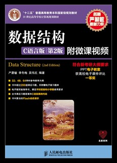
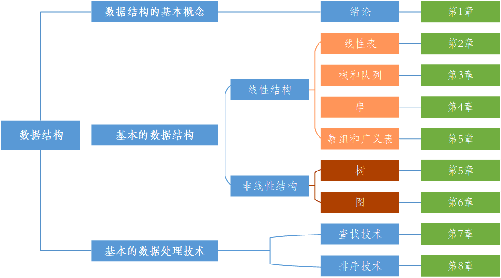

本笔记配套学习教材为严蔚敏《数据结构(C语言版)(第2版)》，ISBN 978-7-115-37950-4，封面如图所示。






推荐参考图书：程杰《大话数据结构(溢彩加强版)》&ensp;[配套资源](https://www.tup.tsinghua.edu.cn/booksCenter/book_08952301.html)

推荐配套课程：[青岛大学-王卓-数据结构 - 哔哩哔哩](https://www.bilibili.com/read/cv2306631/)

配套教学资源：[数据结构（C语言版）（第2版）-图书-人邮教育社区](https://www.ryjiaoyu.com/book/details/3489)

## 绪论


### 数据结构的研究内容

---

计算机主要用于**数值计算**时，一般经过如下几个步骤：

**首先** 从<u>具体问题</u>抽象出<u>数学模型</u>，

**然后** 设计一个解此数学模型的<u>算法</u>，

**最后** 编写<u>程序</u>，进行<u>测试、调试</u>，直到解决问题。

---

寻求数学模型的实质是<u>分析问题</u>，从中<u>提取操作的对象</u>，并<u>找出</u>这些操作对象之间的联系，然后<u>用数学语言加以描述</u>，即建立相应的数学方程。

数据结构主要研究<u>非数值计算</u>问题，非数值计算无法用数学方程建立数学模型。**(共性)**

非数值计算问题的数学模型不再是数学方程，而是诸如线性表、树和图的数据结构。

数据结构是一门研究<u>非数值计算程序设计中的操作对象</u>，以及<u>这些操作对象之间的关系和操作</u>的学科。

---

### 基本概念和术语
#### 数据、数据元素、数据项和数据对象

- 数据 (Data)   `信息的载体`    `(集合)`

    所有<u>能输入到计算机中并被计算机程序处理的符号</u>的总称。

- 数据元素 (Data Element)   `数据的基本单位`    `(集合的个体)`

    在计算机中通常作为一个整体进行考虑和处理。

- 数据项 (Data Item)    `(组成个体的内容)`

    组成数据元素的、有独立含义的、不可分割的最小单位。

- 数据对象 (Data Object)    `(集合的子集)`

    性质<u>相同的数据元素</u>的集合

#### 数据结构

数据的<u>运算</u>和<u>实现</u>，即对数据元素可以施加的操作需在<u>相应的存储结构</u>上实现。

---

数据结构包括 **逻辑结构** 和 **存储结构** 两个层次。

- 逻辑结构于存储结构的关系
```
存储结构是逻辑关系的映像与元素本身的映像。
逻辑结构是数据结构的抽象，存储结构是数据结构的实现。
```
---
##### 逻辑结构

数据的**逻辑结构**是从<u>逻辑关系</u>上描述数据，它<u>与数据的存储无关，是独立于计算机的</u>，数据结构可以看作<u>从具体问题抽象出来的数学模型</u>。


---

(1) 集合结构

除了“属于同一集合”的关系外，没有其他关系。

(2) 线性结构

数据元素间存在<u>一对一</u>的关系。 `有且仅有一个开始和终端，所有结点最多一个直接前驱和后继。`

(3) 树结构

数据元素之间存在<u>一对多</u>的关系。   `一个结点可能有多个直接前驱和后继`

(4) 图结构或网状结构

数据元素之间存在<u>多对多</u>的关系。

---

##### 存储结构 (物理结构)

数据对象<u>在计算机的存储表示</u>称为**数据结构**，也称为**物理结构**。

```
数据元素及其关系 在 计算机存储结构中的结构 (存储方式)。
数据结构在计算机中的表示。
```

(1) 顺序存储结构

顺序存储结构是<u>借助元素在存储器中的相对位置来表示数据元素之间的逻辑关系</u>。

```
用一组连续的存储单元依次存储数据元素。
数据之间的逻辑关系由元素的位置表示。
```

(2) 链式存储结构


## 线性表

## 栈和队列

## 串、数组和广义表

## 树和二叉树

## 图

## 查找

## 排序